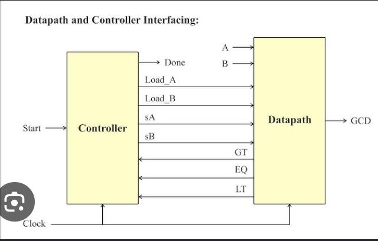

# MyProject 

# flowchart

This picture explains the hardwares that are required as well as the states that were required to build the fsm module 

# datapath
1. Registers A B
2. Mux 
3. Comparator
4. Subtractor 

# fsm

S0 : Idle : Load A
S1 : Load B
S2 : Compare A and B and select the input to subtractor in correct order 
     if A>B then Input to subttractor is A and B goes to s3 
     if A< B then Input to subttractor is  B and A goes to s4
     if A = B then goes to fial state s5
s3 : subtracts and sends the output to bus and update the register A to (A-B) output of the subtractor and continues from S2
s4 : subtracts and sends the output to bus and update the register B to (B-A) output of the subtractor and continues from S2
s5 : gives the ouput and stays in the same state 

# synthesised harware

synthesised datapath :

synthesised controller path 

# download

(-----------must need to have gtkwave and icarus Verilog installed in your system----------------)
to run the file download all the file with extension .v in a particular folder. Then open terminal go the folder where all the downloaded files are there. 

run the following :

iverilog -o tb-of.vvp pipo.v mux.v subt.v comp.v data_path.v fsm.v tb.v
vvp tb-of.vvp 
gtkwave tb.vcd 

# iverilog -o tb-of.vvp pipo.v mux.v subt.v comp.v data_path.v fsm.v tb.v

It complies all the files and create an executable file for tb.v which have instantiated the other modules data_path.v and fsm.v which in turn have instantiated pipo.v mux.v subt.v comp. so it is mandatory to mentioned all the files that are instantiated in other modules for compilation.

# vvp tb-of.vvp

running / executing the output file corresponding to the testbench. Here we can see the simulation time, values of a and b 

# gtkwave tb.vcd

opens the waveform window through gtkwave software to see the simulation results in waveform

# points to notes 

to change the input values go to tb.v and change the values in the initial block that has the following lines

data_in = 143;     (enter values from 0 to 255 since the registers are defined to hold only 8 bit value)
#10 data_in = 78;

